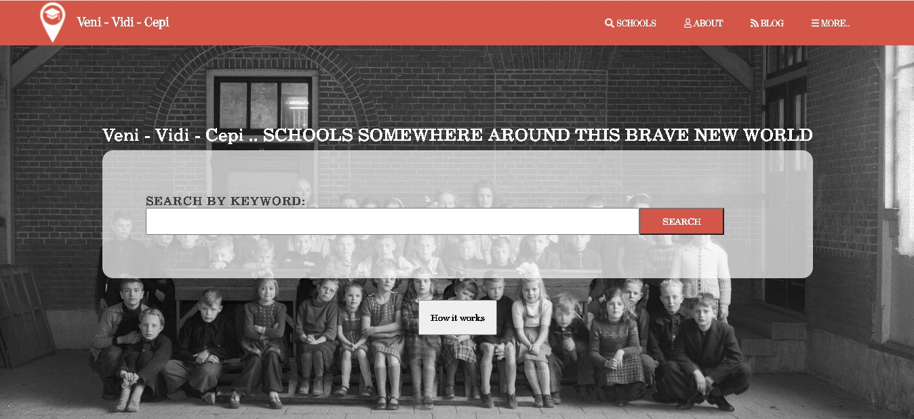

## HTML 2.0 CAPSTONE PROJECT - DIRECTORY OF SCHOOLS

## Built With

- HTML/CSS
- This is a pure css project. <b>No frameworks used.
  
## This website is live, you can check it here: [Live demo](https://confident-feynman-eebcb9.netlify.app/)

## ✒️  Author 

👤 **Mert Gündüz**
- Github: [@mgunduz1](https://github.com/mgunduz1)
- Linkedin: [Mert Gunduz](https://www.linkedin.com/in/mert-gunduz-875280202/)

## Show your support ⭐️⭐️

If you've read this far....give a star to this project ⭐️!

## Usage
If you want to use it locally download or clone the repo with the following command on a terminal:

git clone https://github.com/mgunduz1/HTML2.0-Capstone-Directory-of-Schools.git

cd to the folder and open the index.html in your browser

## 📝 License

https://www.behance.net/gallery/25563385/PatashuleKE
